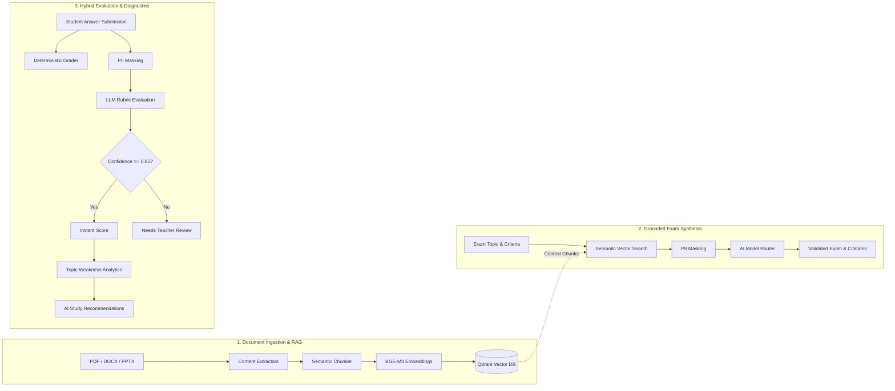

# Draya API 🧠📚

> **An AI-powered EdTech backend engineered for tutoring centers and private academies, built with ASP.NET Core 10, Clean Architecture, and an end-to-end RAG assessment engine.**

[](https://dotnet.microsoft.com/)
[](https://blog.cleancoder.com/)
[](https://qdrant.tech/)
[](https://huggingface.co/BAAI/bge-m3)
[](https://learn.microsoft.com/aspnet/core/signalr/)
[](https://paymob.com/)

---

## 🌟 Overview

Most learning management systems (LMS) are glorified file repositories. **Draya** was built to change that by turning static course materials into an interactive, intelligent teaching assistant:

1. **Automates Exam Creation:** Ingests lecture slides and PDFs, semantically indexes them, and synthesizes curriculum-aligned exams with source-grounded citations.
2. **Hybrid Exam Grading:** Grades multiple-choice questions deterministically while evaluating open-ended essays against dynamic rubrics, routing uncertain answers to teachers for manual review.
3. **Personalized Diagnostic Reports:** Tracks student error patterns at the topic level and uses generative AI to generate targeted study recommendations and parent performance summaries.
4. **Integrated FinTech:** Powers classroom enrollments and digital teacher wallets backed by double-entry ledgers and Paymob payment webhooks.

---

## 🤖 Deep Dive: The AI & RAG Engine



### 1. Document Ingestion & Vector Pipeline
* **Multi-Format Parsing:** Custom extractors parse `.pdf` (PdfPig), `.docx` (OpenXML), and `.pptx` presentations into normalized text streams.
* **Semantic Chunking:** Text is broken down using a windowed chunker (1,000 characters with 150-character overlap) preserving sentence and paragraph continuity.
* **Multilingual Vector Embeddings:** Chunks are vectorized using the state-of-the-art **BAAI/bge-m3** multimodal/multilingual embedding model and stored in a cloud **Qdrant Vector Database**.
* **Resilient Infrastructure:** Network calls to embedding services are guarded with **Polly** exponential-backoff retry policies.

### 2. Grounded Exam Generation (Anti-Hallucination)
* **Context-Injected Prompts:** When a teacher requests an exam, semantic search retrieves relevant chunks. The LLM is forced to cite exact `<chunk id="...">` tags for every generated question.
* **Prompt Injection Defense:** User inputs and instructions are treated as untrusted data (`<teacher_instructions>`) and isolated from system constraints.
* **Structured Output Enforcement:** High-volume question generation uses strict JSON Schema mode to guarantee syntax validity across Multiple Choice, True/False, Fill-in-the-Blank, and Essay formats.

### 3. Hybrid Subjective Exam Grading
* **Two-Tier Scoring:** Deterministic scoring handles objective questions instantly in C#. Essay and short-answer questions are dispatched to an LLM evaluator with the question's rubric and criteria.
* **Confidence Scoring & Human-in-the-Loop:** Each AI evaluation returns an explanation and a `confidenceScore` (0.0 to 1.0). If confidence falls below **0.85**, the answer is automatically flagged as `NeedsTeacherReview`, ensuring teachers maintain final authority.
* **Audit Trail:** Teacher score overrides are permanently preserved in audited ledger tables rather than overwritten.

### 4. Topic Weakness Diagnostics & Reporting
* **Root-Cause Analysis:** The analytics engine groups student mistakes by topic, calculating proficiency percentiles across the classroom.
* **Targeted Remediation:** For topics needing urgent improvement, student failure patterns and incorrect answers are analyzed by the AI to produce supportive, actionable study recommendations.

### 5. Zero-Leakage PII Privacy Protection
* Before any student or teacher data is sent to external LLMs, an in-memory **PII Anonymization Pipeline** replaces real names, emails, and database keys with deterministic surrogate GUIDs.
* LLM responses are de-anonymized safely inside the application boundary before persisting to SQL Server.

---

## 🏛️ Clean Architecture & Tech Stack

```text
src/
  ├── Draya.Domain/          # Core entities, invariants, value objects, repository interfaces (Zero dependencies)
  ├── Draya.Application/     # CQRS Commands & Queries (MediatR), DTOs, FluentValidation, AI orchestrators
  ├── Draya.Infrastructure/  # EF Core 10, SQL Server, Qdrant client, AI Model Router, Cloudinary, Paymob
  └── Draya.Api/             # ASP.NET Core Web API, JWT middleware, SignalR hubs, DI composition root
```

* **Core Framework:** .NET 10 (C#) Web API
* **Architecture:** Clean Architecture + CQRS via MediatR + FluentValidation
* **Database & ORM:** Microsoft SQL Server with Entity Framework Core 10
* **Vector Database:** Qdrant Cloud
* **Embeddings & AI:** BAAI/BGE-M3 + OpenRouter / ITI Model Router (Claude Sonnet 4.6 / Haiku / Nemotron)
* **Real-Time Communication:** SignalR Hubs (`/hubs/materials`, `/hubs/exam-generation`, `/hubs/exam-grading`, `/hubs/qa`, `/hubs/reports`)
* **Asynchronous Jobs:** Background Task Queues (`IHostedService`)
* **Payments & Billing:** Paymob (HMAC SHA512 Webhook Verification) + Dual-Balance Teacher Wallet Ledger
* **Media Storage:** Cloudinary SDK for secure video streaming and file management

---

## 🚀 Getting Started

### Prerequisites
* [.NET 10.0 SDK](https://dotnet.microsoft.com/download/dotnet/10.0)
* [SQL Server](https://www.microsoft.com/sql-server) (or Azure SQL)
* A [Qdrant](https://cloud.qdrant.io/) cluster instance

### 1. Clone the Repository
```bash
git clone https://github.com/DrayaTeam/Draya-API.git
cd Draya-API
```

### 2. Configure Local Secrets (Zero Plaintext Secrets in Git)
This project uses ASP.NET Core **User Secrets** for safe local development. Initialize your local configuration without modifying `appsettings.json`:

```bash
# Database
dotnet user-secrets set "ConnectionStrings:DrayaLiveDb" "Server=YOUR_SERVER;Database=YOUR_DB;User Id=YOUR_USER;Password=YOUR_PASSWORD;Encrypt=True;TrustServerCertificate=True;" --project src/Draya.Api

# JWT Secret (minimum 32 characters)
dotnet user-secrets set "JwtSettings:SecretKey" "YOUR_SUPER_SECRET_KEY_AT_LEAST_32_CHARS" --project src/Draya.Api

# Qdrant Vector DB
dotnet user-secrets set "Qdrant:Host" "YOUR_QDRANT_HOST" --project src/Draya.Api
dotnet user-secrets set "Qdrant:ApiKey" "YOUR_QDRANT_API_KEY" --project src/Draya.Api

# AI Credentials
dotnet user-secrets set "EmbeddingApi:ApiKey" "YOUR_HUGGINGFACE_KEY" --project src/Draya.Api
dotnet user-secrets set "AiCredentials:or-main-01" "YOUR_OPENROUTER_KEY" --project src/Draya.Api
```

### 3. Build & Run
```bash
dotnet restore
dotnet build
dotnet run --project src/Draya.Api
```

Swagger documentation will be available at `http://localhost:5286/swagger` (or your configured launch port).

---

## 🧪 Testing

The solution includes comprehensive unit and integration test suites split across all architectural layers:

```bash
dotnet test
```

* `Draya.Domain.Tests`: Invariant validation and domain rules.
* `Draya.Application.Tests`: Command/Query handler mocks and business workflows.
* `Draya.Infrastructure.Tests`: AI router, vector store, and repository tests.
* `Draya.Api.Tests`: Integration tests using `CustomWebApplicationFactory`.

---

## 🔒 Security & Privacy

* **HMAC Webhook Verification:** Paymob transaction webhooks are cryptographically authenticated via HMAC-SHA512. Client-side payment claims are never trusted.
* **PII Guardrails:** Student identifiers are stripped before external LLM interaction.
* **Stateless JWT + Refresh Token Rotation:** Revocable refresh tokens and secure token expiration.

---

## 📄 License
This project was developed by the **Draya Team** as an ITI graduation project. All rights reserved.
